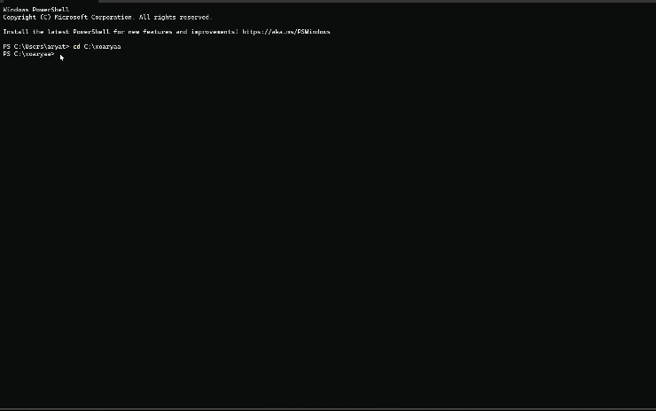

# npx card


## Overview

`xoaryaa` is an interactive business card in the form of a Node.js CLI tool. By simply running `npx xoaryaa` in any terminal with Node.js installed, users can instantly access my professional information. This project is open source and encourages contributions from the developer community.

## Features

- Displays my contact information, social media profiles, and other relevant details.
- Simple to use: Just run `npx xoaryaa` in any terminal.
- Open source: Contributions are welcome!

## If you’d like to contribute to this project, follow these steps:
1. Clone the repository
   
```bash
git clone https://github.com/xoaryaa/npx_card.git
```

2. Navigate to the project directory

```bash
cd xoaryaa
```

3. Install the dependencies

```bash
npm install
```

### Make your changes and submit a pull request!

